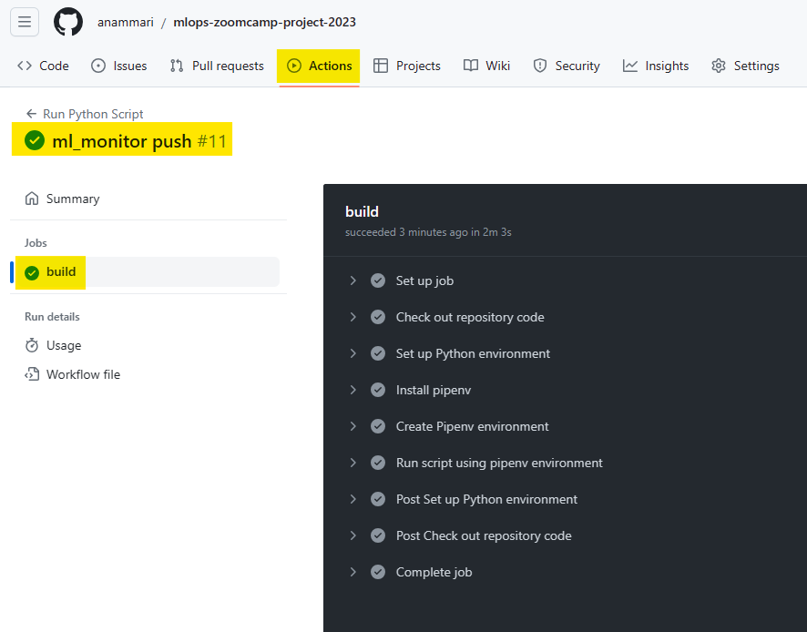
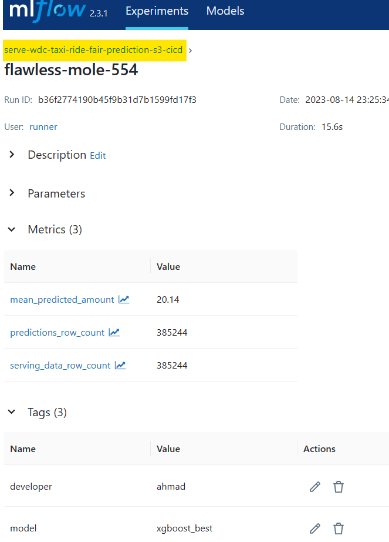
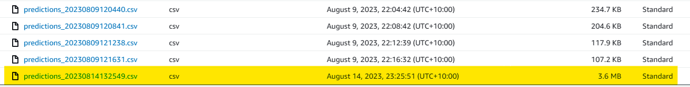

# CICD GitHub Actions Workflow for Running a ML Model Serving Script

## Introduction

This section contains a GitHub Actions workflow that automatically runs a Python ML model serving script every time new code is pushed to the main branch. The workflow is defined in the `.github/workflows/main.yml` file.

## Workflow Overview

The workflow consists of several steps that are executed in sequence when the workflow is triggered. Here is an overview of the key steps in the workflow:

1. Check out repository code: This step checks out the repository code to the GitHub Actions runner, so that it can be accessed by subsequent steps.

2. Set up Python environment: This step sets up a Python environment on the GitHub Actions runner, using the specified version of Python.

3. Install pipenv: This step installs pipenv, which is used to manage the virtual environment and dependencies for the Python script.

4. Create Pipenv environment: This step creates a pipenv virtual environment and installs the dependencies specified in the `Pipfile` and `Pipfile.lock` files located in the `ml_train` directory.

5. Run script using pipenv environment: This step runs the specified Python script within the pipenv virtual environment, using the dependencies installed in the virtual environment. The script is located in the `ml_serve` directory and is named `serve_fare_prediction_aws_cicd.py`.

## Screenshots of Workflow Execution

When new code is pushed to the main branch of the repository, the workflow is automatically triggered and starts executing the steps defined in the main.yml file. You can view the progress of the workflow execution on the “Actions” tab of your repository on GitHub.

Here are some screenshots showing various stages of a successful workflow execution:

1. GitHub Actions - Workflow Execution:

  

2. MLflow UI - Experiment Details:

  

3. S3 Bucket - Output File Storage:

  

