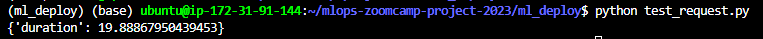

# MLOps Zoomcamp Course Project (cohorts 2023)

  

## Project Title: TBD

## Problem Statement:

In this MLOps zoomcamp e-course capstone project, I aim to tackle the challenge of estimating the cost for passengers taking regular taxi rides from one location to another within Washington, DC, along with nearby areas in Virginia and Maryland. Leveraging the Washington, DC taxi rides dataset, which comprises historical records of taxi rides throughout all 2018 calendar months, I will build a predictive model to provide accurate fare estimates. To ensure the model's accuracy and reliability, I will validate and test it using the first six calendar months' data from 2019. The dataset contains comprehensive information on taxi rides that occurred within the boundaries of the DC-area. The dataset can be accessed through the provided [download link](https://opendata.dc.gov/search?categories=transportation&q=taxi&type=document%20link). I will be tasked with employing MLOps techniques and methodologies learned throughout the course to streamline the development, deployment, and monitoring of the machine learning model. By successfully addressing this problem, we can enhance the taxi service experience for both drivers and passengers while demonstrating the practical application of MLOps principles in real-world scenarios.

## Technologies:

- Cloud: AWS + Localstack
- Experiment tracking tools: MLFlow
- Workflow orchestration: Prefect
- Monitoring: Evidently (metrics calculation) & Grafana (data vizualisation)
- CI/CD: Github actions
- Infrastructure as code (IaC): Terraform
- Unit Testing: pytest
- Integration testing: Localstack
- Model training: Linear Regression, Lasso, XGBoost
- Model tuning: Hyperopt
- Containerization: Docker
- Dependency management: Pipenv

## Data Inputs and Outputs

The ML model for estimating trip fare takes latitude and longitude coordinates as inputs, which correspond to the pickup and drop-off locations of a taxi ride in Washington, DC. These coordinates are then utilized by the ML model to predict the trip fare accurately. The service does not require human-readable addresses for geocoding; instead, it expects direct latitude and longitude values. To interact with the service after the deployment of the ML model into production, users can use a mobile application where they can visually drop pins on a map to specify the pickup and drop-off locations. Alternatively, users may have the option to use geocoding features from services like Google Maps as an alternative input method for specifying locations.

  

## Model Training

In [model training](./ml_train/), we leverage multiple ML algorithms, including Linear Regression, Lasso, and XGBoost to develp the fare predictor. We also apply hyperparameter optimisation / tuning using Hyperopt. We also integrate MLFlow to track our ML training experiments and log the trained models in AWS S3. 

1. Firstly, we create AWS S3 bucket and RDS service (PostgreSQL database) for the backend of our MLFlow experiment tracking.

  

2. We then run `./ml_train/mlflow.sh` to launch the MLFlow experiment tracking UI with RDS+S3 backend.

  

3. We run `./ml_train/fare-prediction-aws.ipynb` notebook to run the ML training experiments, including model tuning and logging the best ML model to S3 artifacts. 

  

## Model Serving

The ML model serving pipeline is fully explained and demonstrated in the [ml_serve README](ml_serve/README.md) file

## Model Deployment

For [model deployment](./ml_deploy), the ML model has been deployed as a Flask Web service on an EC2 instance and then deployed into a Docker container for production.

1. Firstly, we launch the MLflow server with an AWS S3 bucket and RDS service (PostgreSQL database) backend to store all tracking and artifacts.

  

2. We then run the Docker container which has the Flask app `./ml_deploy/predict_mlflow.py` to launch the Flask Web service inside Docker. 

  

3. We finally run the `./ml_deploy/test_request.py` testing script which sends a POST request, including the features of a random ride, to the Flask Web service in the container, and then receives back a ride fare prediction.

  

 

## Model Monitoring

The ML model monitoring proceeses and dashboard are fully explained and demonstrated in the [ml_monitor README](ml_monitor/README.md) file
