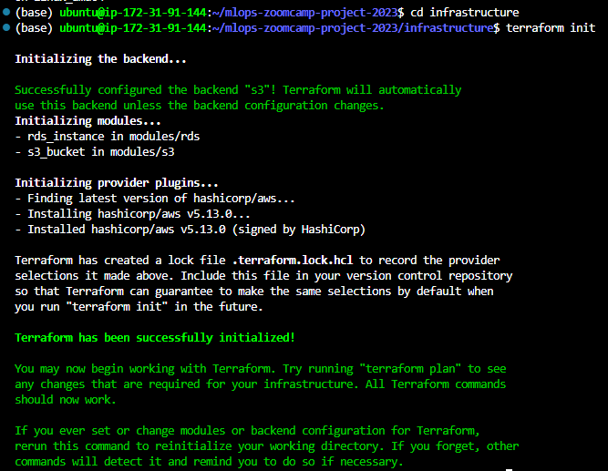
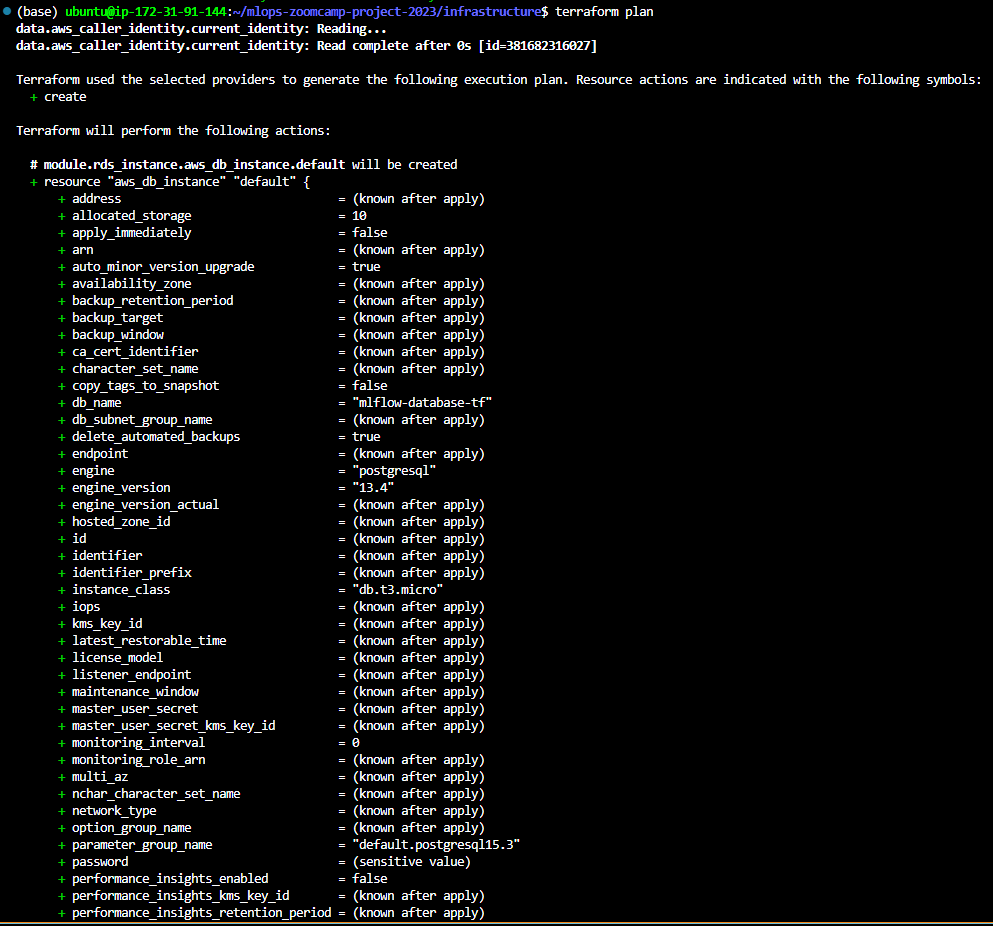
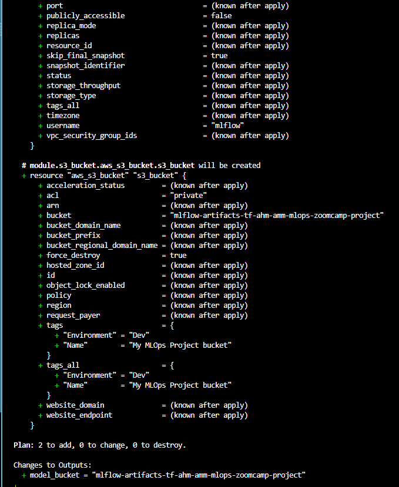
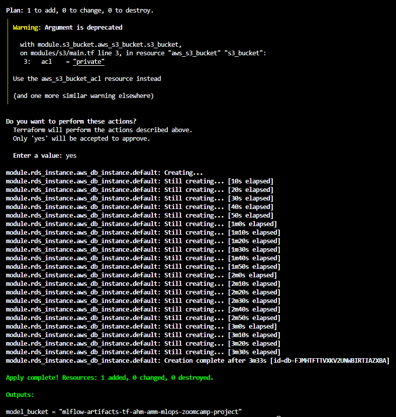
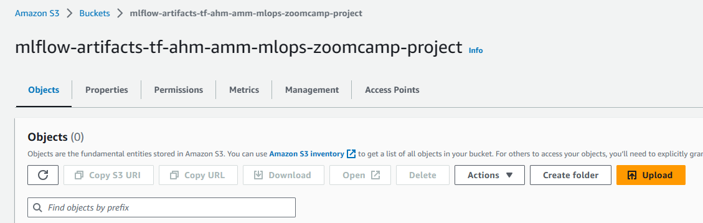
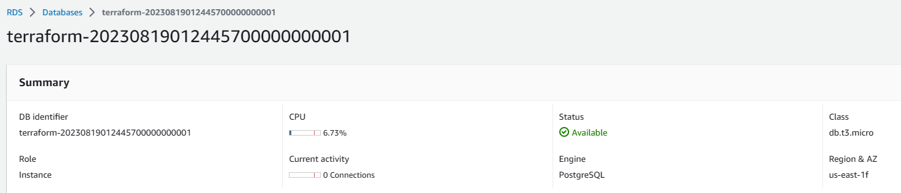

# Terraform Configuration for Creating an RDS Instance and an S3 Bucket on AWS

## Introduction

This section contains a Terraform configuration that creates an RDS instance and an S3 bucket on AWS. The configuration is defined in the `modules/rds/main.tf` and `modules/s3/main.tf` files.

## Configuration Overview

The configuration consists of three main resources that are created by Terraform: an aws_db_instance resource, an aws_db_parameter_group resource, and an aws_s3_bucket resource. Here is an overview of the key attributes of each resource:

- aws_db_instance resource: This resource creates an RDS instance on AWS with the specified settings, such as allocated storage, engine, engine version, instance class, username, password, parameter group name, and skip final snapshot. The resource also outputs the endpoint of the RDS instance, which can be used to connect to the database.

- aws_db_parameter_group resource: This resource creates a parameter group for the RDS instance, which defines the parameters and values that apply to the database engine. The resource specifies the name, family, and description of the parameter group, as well as any custom parameters that are needed for the PostgreSQL engine.

- aws_s3_bucket resource: This resource creates an S3 bucket on AWS with the specified settings, such as bucket name, region, acl, versioning, encryption, and tags. The resource also outputs the arn and id of the S3 bucket, which can be used to reference the bucket in other resources or policies.

## Screenshots of Configuration Execution

To execute the configuration, you need to run the following commands in the terminal:

- terraform init: This command initializes the Terraform configuration and downloads any required providers or modules.

  

- terraform plan: This command shows the plan of what resources will be created, modified, or destroyed by Terraform.

  

  

- terraform apply: This command applies the changes according to the plan and creates the resources on AWS.

  

## Output 

The output of running the configuration is a new S3 bucket and RDS (PostgresSQL DB) instance. 

### S3 Bucket

  

### RDS Instance

  

