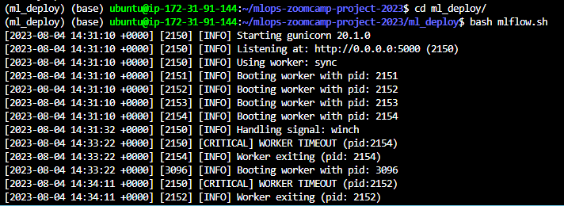
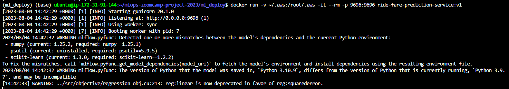
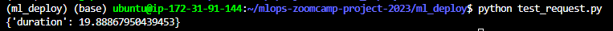

For [model deployment](./ml_deploy), the ML model has been deployed as a Flask Web service on an EC2 instance and then deployed into a Docker container for production.

1. Firstly, we launch the MLflow server with an AWS S3 bucket and RDS service (PostgreSQL database) backend to store all tracking and artifacts.

  

2. We then run the Docker container which has the Flask app `./ml_deploy/predict_mlflow.py` to launch the Flask Web service inside Docker. 

  

3. We finally run the `./ml_deploy/test_request.py` testing script which sends a POST request, including the features of a random ride, to the Flask Web service in the container, and then receives back a ride fare prediction.

  

 