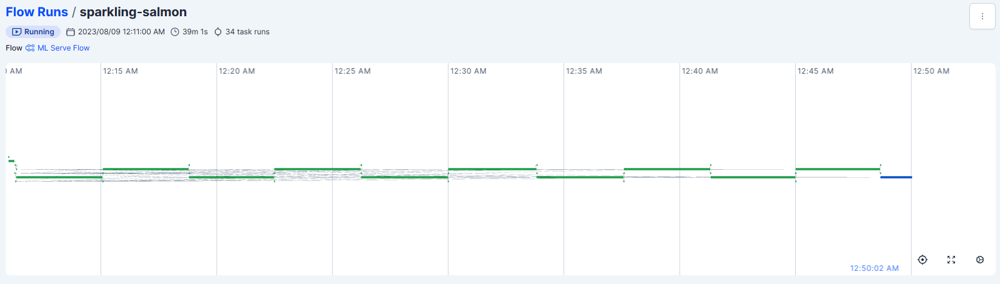
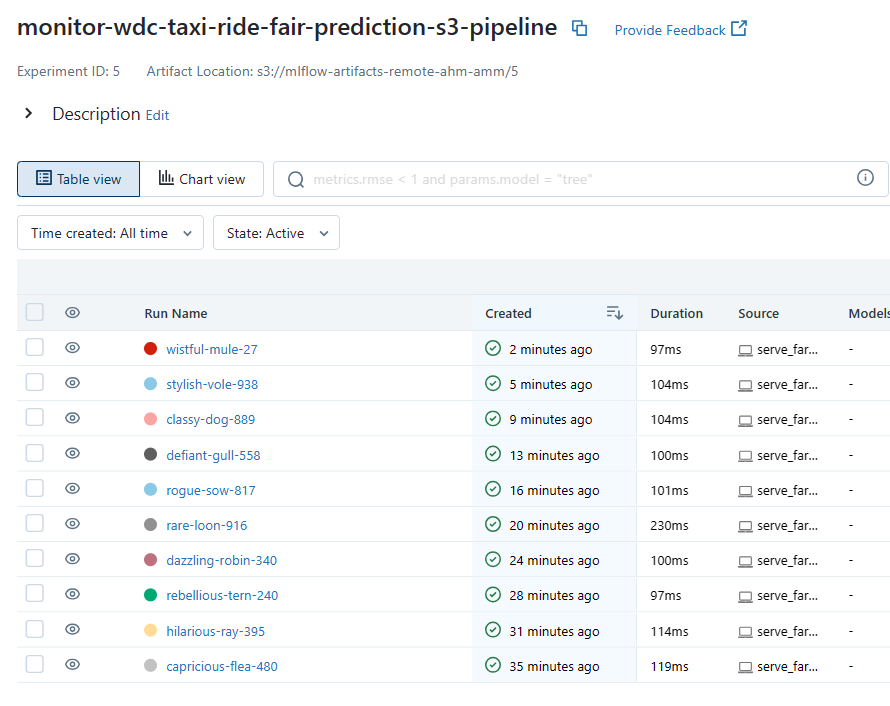
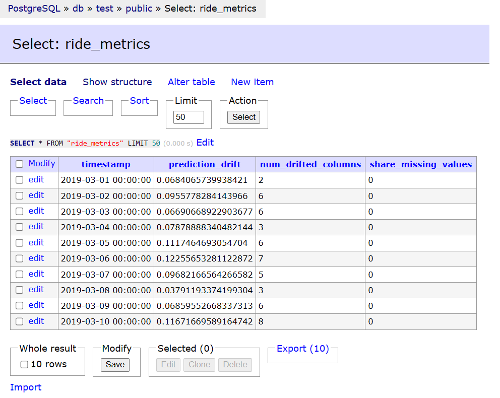
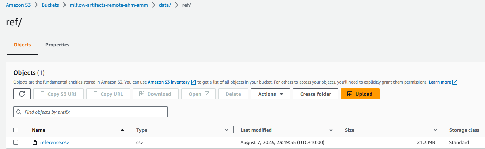
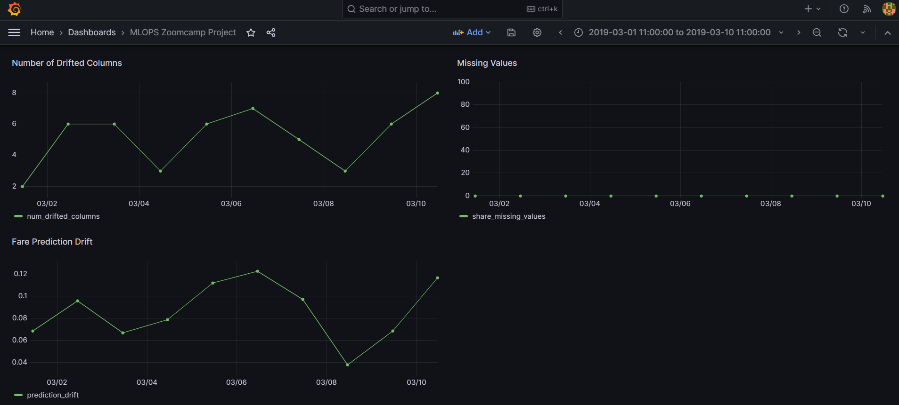

# Model Monitoring for Washington, DC Taxi Ride Fare Prediction

## Introduction

The Model Monitoring section of the MLOps Zoomcamp project is designed to monitor the performance of the XGBoost machine learning model used to predict the cost of regular taxi rides within the boundaries of Washington, DC, and nearby areas of Virginia and Maryland. This section involves tracking and analyzing key metrics to ensure that the model is performing as expected.

## Monitoring Overview

The monitoring process involves several steps, from data retrieval and transformation to metric calculation and visualization. Here is an overview of the key steps in the process:

1. Data Retrieval and Transformation:

The monitoring process starts by running the `serve_fare_prediction_aws_pipeline_create_reference.py` script to predict the fare for the 01/2019 cohort based on the ML model which is loaded from MLFlow with S3 and RDS backend. This running is being tracked and orchestrated using prefect UI.

2. Reference Data Creation:

The `serve_fare_prediction_aws_pipeline_create_reference.py` script also saves the fare predictions of this cohort as a reference data for computing the data and model monitoring metrics using Evidently. The reference data is saved by the script to an S3 bucket.

3. Metric Calculation:

Next, the `serve_fare_prediction_aws_pipeline_evidently_metrics_calculation.py` script is run, which predicts the fare for the 03/2019 cohort based on the ML model which is loaded from MLFlow with S3 and RDS backend. The script computes daily predictions as well as monitoring metrics such as fare prediction drift, number of drifted columns, and missing values.

4. Metric Persistence:

The computed metrics are saved in a Postgres DB, which is used as a back-end DB for a Grafana dashboard showing daily monitoring visualizations.

## Screenshots of Monitoring Execution

Below are screenshots of various components involved in the monitoring process:

1. Prefect UI - Model Monitoring Flow Run:

  

2. MLflow UI - Model Monitoring Experiment Details:

  

3. Adminer (PostgresDB) - Metrics Persistence:

  

4. S3 Bucket - Reference Data Storage:

  

5. Grafana Dashboard - Daily Monitoring Visualizations:

  

