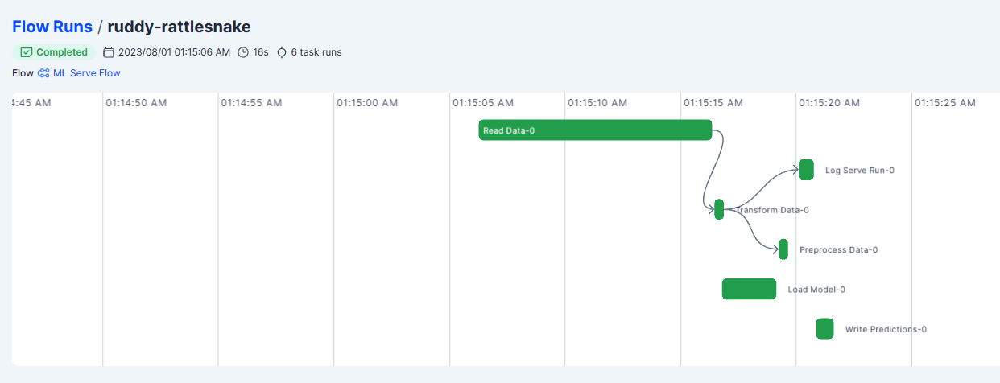
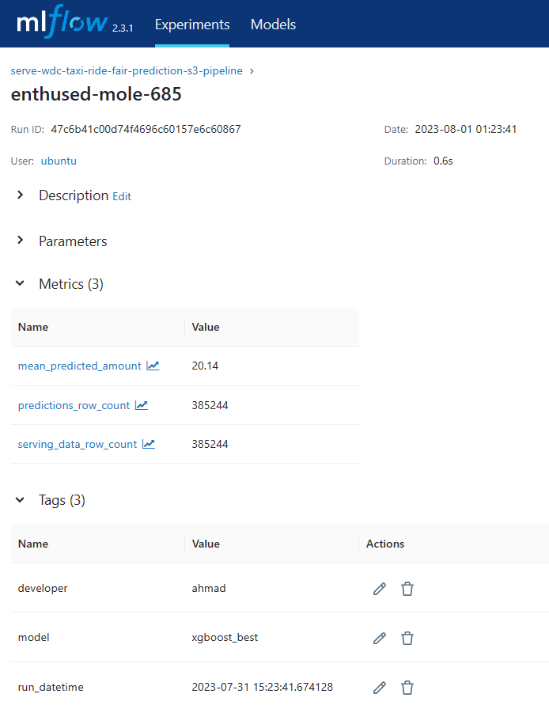
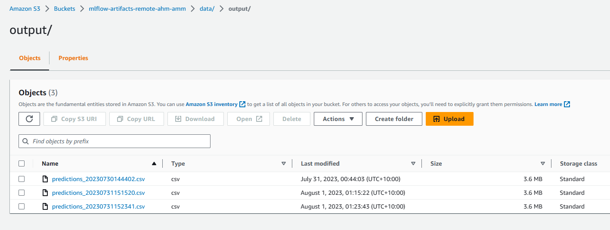
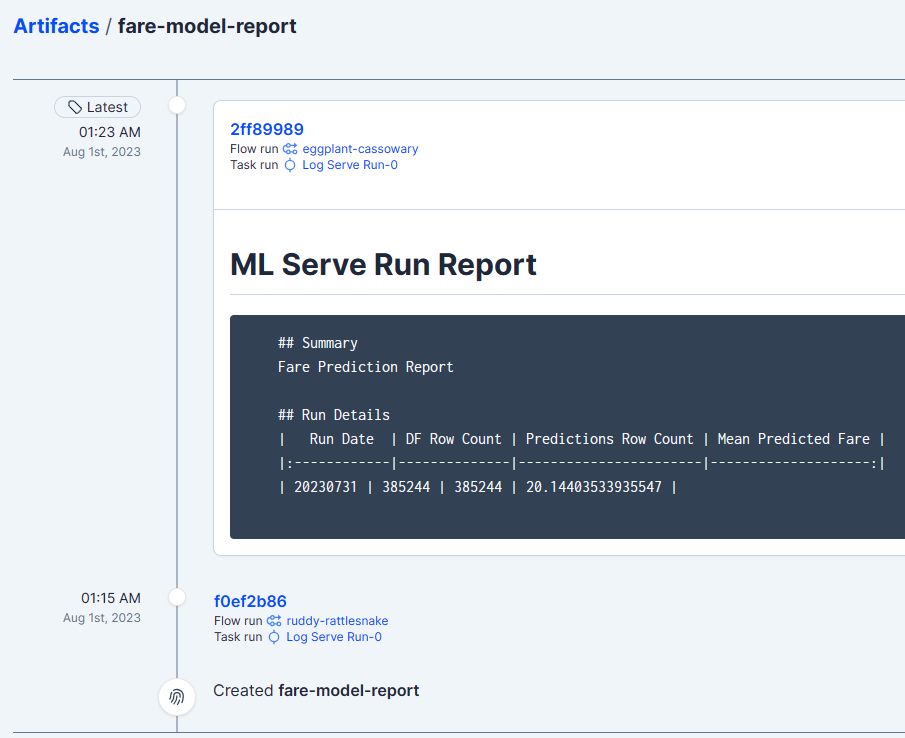

# Model Serving Pipeline for Washington, DC Taxi Ride Fare Prediction

## Introduction

The Model Serving Pipeline is designed to predict the cost of regular taxi rides within the boundaries of Washington, DC, and nearby areas of Virginia and Maryland. The pipeline utilizes an XGBoost machine learning model to make fare predictions based on specific ride information.

## Pipeline Overview

The pipeline involves several steps, from data retrieval to model serving and result persistence. Here is an overview of the key steps in the process:

1. Data Retrieval and Transformation:

The pipeline starts by reading the taxi ride data from an AWS S3 bucket, specifically the TXT files for the specified year and month.
The required columns, including fare amount and location information, are extracted from the data.
The data is transformed, converting the date-time information and creating new columns for month, day of the week, and hour.

2. Model Loading:

The pre-trained XGBoost model is loaded using MLflow. The model was previously trained and logged in an MLflow experiment.

3. Data Preprocessing:

The data is preprocessed to prepare it for prediction. Categorical columns, such as month, day of the week, and hour, are separated from numerical columns representing latitude and longitude.

4. Prediction:

Using the loaded model, the pipeline generates fare predictions based on the preprocessed data.

5. Logging Serve Run Details:

The pipeline logs the details of the served run, such as the row counts, mean predicted fare amount, and developer information, in the MLflow experiment.

6. Persistence of Predictions:

The fare predictions are persisted as a CSV file in an AWS S3 bucket under the 'data/output' folder.

## Pipeline Execution

To execute the Model Serving Pipeline, you can specify the year and month of the taxi ride data you want to predict. The pipeline will then perform the following actions:

1. Read the data from the specified year and month.

2. Transform the data, extracting the relevant columns and converting date-time information.

3. Load the pre-trained XGBoost model from the MLflow experiment.

4. Preprocess the data for prediction, separating categorical and numerical columns.

5. Use the model to predict fare amounts for the given data.

6. Log the details of the served run in the MLflow experiment.

7. Persist the fare predictions as a CSV file in the specified S3 bucket.

## Screenshots of Pipeline Execution

Below are the screenshots of the pipeline execution:

1. Prefect UI - Model Serving Flow Run:

  

2. MLflow UI - Model Serving Experiment Details:

  

3. Output Folder on S3 with Predictions:

  

4. Artifacts of the Tested Experiment - HTML Report:

  

## Conclusion

The Model Serving Pipeline for Washington, DC Taxi Ride Fare Prediction allows users to predict the fare amount based on specific ride information. The pipeline demonstrates seamless integration of MLflow for model tracking and S3 for data storage, ensuring efficient model serving and result persistence.

