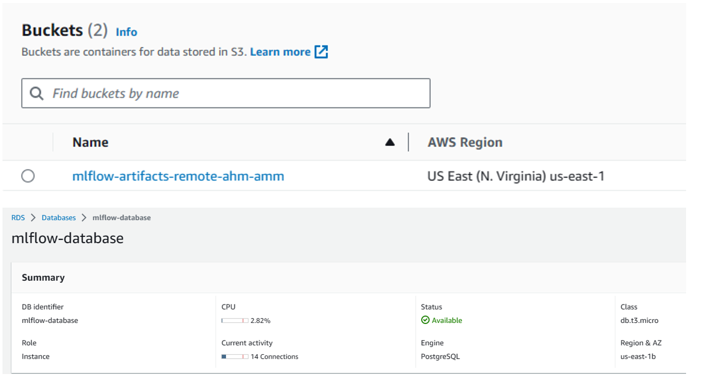

In [model training](./ml_train/), we leverage multiple ML algorithms, including Linear Regression, Lasso, and XGBoost to develp the fare predictor. We also apply hyperparameter optimisation / tuning using Hyperopt. We also integrate MLFlow to track our ML training experiments and log the trained models in AWS S3. 

1. Firstly, we create AWS S3 bucket and RDS service (PostgreSQL database) for the backend of our MLFlow experiment tracking.

  

2. We then run `./ml_train/mlflow.sh` to launch the MLFlow experiment tracking UI with RDS+S3 backend.

  

3. We run `./ml_train/fare-prediction-aws.ipynb` notebook to run the ML training experiments, including hyperparameter optimization (model tuning) via Hyperopt and then logging the best ML model to S3 artifacts. 

  

